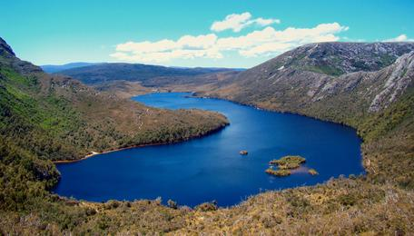

***
## Summary  
Climate change is modifying the thermal structure of lakes around the globe. Because it is difficult to predict how lakes will respond to the many different aspects of climate change (e.g., altered temperature, precipitation, wind, etc.), many researchers are using models to manipulate climate scenarios and simulate lake responses. Lake simulation models provide a powerful tool for exploring the sensitivity of lake thermal structure characteristics to weather.

In this module, students will learn how to set up a lake model and "force" the model with climate scenarios of their own design to test hypotheses about how lakes may change in the future. Once students have mastered running one climate scenario for their lake, they will learn how to use distributed computing tools to scale up and run hundreds of different climate scenarios for their lakes.

The overarching goal of this module is for students to explore new modeling and computing tools while learning fundamental concepts about how climate change will affect lakes. The A-B-C structure of this module makes it flexible and adaptable to a range of student levels and course structures.  

***

## Learning Goals  

By the end of this module, students will be able to:
* Set up and run the General Lake Model (GLM) in the R statistical environment to simulate lake thermal structure.
* Understand how GLM configuration files, driver data, and output files are organized and used.
* Modify the input meteorological data for one GLM model to simulate the effects of different climate scenarios on lake thermal structure.
* Interpret model output from GLM simulations to understand how changing climate will alter lake thermal characteristics.
* Use the GRAPLEr R package to set up hundreds of model simulations that vary input meteorological data, and run those simulations using distributed computing.
* Explore the application of distributed computing for modeling climate change effects on lakes.  

## Context for Use  
This entire module can be completed in one 3-4 hour lab period or three 60-minute lecture periods for senior undergraduate students or graduate students. Activities A and B could be completed with upper level students in two 60-minute lecture periods, with Activity C as a separate add-on activity. We found that teaching this module in one longer lab section with short breaks was more conducive for introductory students than multiple 1-hour lecture periods.  

A prior version of this module has been used in upper-level undergraduate and graduate-level Freshwater Ecology and Limnology courses (Parts A and B for undergraduate courses; Parts A, B, and C for graduate-level courses). Module materials can be tailored to increase or decrease the background information depending on students' quantitative skills. We note that this module has been successfully taught to senior ecology undergraduate students who had not used R programming software before: depending on the number of students, having additional instructors available to answer questions is useful (we used a 6:1 student:teacher ratio).  

It is helpful for the instructor to have a working knowledge of R and the General Lake Model (GLM) to help troubleshoot and respond to student questions. We provide a brief introduction to R and GLM as part of the Teaching Materials, below.  

## Description and Teaching Materials  
### Quick overview of the activities in this module  
See the instructor manual, provided below, for a step-by-step guide for carrying out this module, and an activity answer key. A student handout, describing Activities A, B, and C, and instructor PowerPoint are also provided.  

* **Activity A**: Students plot water temperatures from a lake model.  
* **Activity B**: Students develop a climate scenario, generate hypotheses, and model how the lake responds.  
* **Activity C**: Students use distributed computing to run hundreds of lake model simulations.  

### Why macrosystems ecology?
Macrosystems ecology is the study of ecological dynamics at multiple interacting spatial and temporal scales (e.g., Heffernan et al. 2014). Macrosystems ecology recently emerged as a new sub-discipline of ecology to study ecosystems and ecological communities around the globe that are changing at an unprecedented rate because of human activities (IPCC 2013). The responses of ecosystems and communities are complex, non-linear, and driven by feedbacks across local, regional, and global scales (Heffernan et al. 2014). These characteristics necessitate novel approaches for making predictions about how systems may continue to change across time and space. Consequently, macrosystems ecologists are increasingly combining large datasets of sensor observations with simulation models of ecological phenomena to predict how changes in climate, land use, and other factors may affect the structure and function of communities and ecosystems (Weathers et al. 2016).  

### Addressing macrosystems questions using models
Lakes around the globe are experiencing the effects of climate change. Because it is difficult to predict how lakes will respond to the many different aspects of climate change (e.g., altered temperature, precipitation, wind, etc.), many researchers are using models to manipulate climate scenarios and simulate lake responses. Lake simulation models provide a powerful tool for exploring the sensitivity of lake thermal structure characteristics to weather.  

In this module, students will learn how to set up a lake model and "force" the model with climate scenarios of their own design to examine how lakes may change in the future. While it is relatively easy to run one lake model on an individual computer, it becomes more challenging to run hundreds of models, as the computational workload becomes more time-consuming. To overcome this problem, we have developed an R package called GRAPLEr (Subratie et al. 2017), which allows students to submit hundreds of model simulations through the R statistical environment, run those models efficiently and quickly using distributed computing tools, and then retrieve the model output. The GRAPLEr allows students to harness cyberinfrastructure tools commonly used in computer science to improve the computing speed that are rarely used in ecology and freshwater sciences. Ultimately, using the GRAPLEr and similar tools will allow us to improve our understanding of climate change effects of lakes.

### Workflow for this module:
1. Have students install R and RStudio software on their laptops before class (send them the "R You Ready for EDDIE" file, below, for step-by-step directions).  
2. Give students their handout ahead of time to read over prior to class, or distribute handouts when they arrive to class.  
3. Instructor gives brief PowerPoint presentation on climate change effects on the thermal structure of lakes, an overview of the GLM model, and the GRAPLEr software.
4. After the presentation, the students divide into teams, set up the GLM files and R packages on their computer to run a default lake model and explore the output (Activity A).
5. The instructor then introduces Activity B.
6. The students create hypotheses about how aspects of climate change may affect lakes (e.g., altered precipitation), develop a climate change scenario for their model lake to test their hypotheses, force a model lake with their scenario, and analyze the output to determine how their scenario alters lake thermal structure (Activity B).
7. After the students have analyzed the model output, they create some figures with their partners to present their model simulation and output to the rest of the class.
8. The instructor then moderates a discussion of the scenarios and output presented in Activity B and introduces Activity C.
9. The students go through a demonstration of the GRAPLEr R package and then design and carry out their own simulation 'experiment' with their partners. If time permits, the students create additional figures from their experiment results and share them with the class, with the instructor moderating the discussion (Activity C).  

### Teaching Materials:
* Files for running the Module 1 (Zip Archive 1.2MB Oct10 19)- Zipped folder of all files needed to run the module in RStudio
* R You Ready for EDDIE? Module 1 (Microsoft Word 2007 (.docx) 28kB Nov19 18)- Step-by-step * guide to download R, RStudio, and module files
* Student Handout (Microsoft Word 2007 (.docx) 568kB Nov19 18)- Handout for students to work through while completing the module
* Instructor Manual (Microsoft Word 2007 (.docx) 767kB Dec17 18)- Instructor manual and troubleshooting for the module.
* Ready, Set, EDDIE: Module 1 (Microsoft Word 2007 (.docx) 363kB Nov19 18)- Instructor introduction to R and the General Lake Model (GLM)
* Instructor's Powerpoint (PowerPoint 2007 (.pptx) 7MB Dec17 18)- PowerPoint presentation to introduce core concepts & module activities
* Getting Started: Module 1 (PowerPoint 2007 (.pptx) 2.5MB Nov19 18)- Additional PowerPoint slides that provide a basic orientation to RStudio, and provide troubleshooting tips for common challenges in the module.  

## Teaching Notes and Tips
### Important Note to Instructors:

The zip folder of teaching materials was last updated using R version 3.5.1 and GLM version 2.2.0rc5. All R packages used in this module are continually being updated, so these module instructions will periodically change to account for changes in the code. If you find any errors or have other feedback about this module, please contact the module developers. Visit our website: http://graple.org/ for the most recent version of the R packages for this module.

If you have any questions or any problems with this module, please reach out to us at .

### Assessment
* Activity A: Students plot water temperatures from a default model lake, using real climate forcing data.
* Activity B: Students develop a climate scenario, generate hypotheses, modify their meteorological driver file, and model how the lake responds.
* Activity C: Students use distributed computing to run hundreds of lake model simulations.

### References and Resources
#### Optional pre-class readings
* Williamson, C.E., J.E. Saros, W.F. Vincent, and J.P. Smol. 2009. Lakes and reservoirs as sentinels, integrators, and regulators of climate change. Limnology & Oceanography 54: 2273-2282.  
* Sahoo, G. B., S.G. Schladow, J.E. Reuter, and R. Coats. 2011. Effects of climate change on thermal properties of lakes and reservoirs, and possible implications. Stochastic Environmental Research and Risk Assessment 25.4: 445-456.  
* Hipsey, M.R., L.C. Bruce, and Hamilton, D.P. 2014. GLM - General Lake Model: Model overview and user information. AED Report #26, The University of Western Australia, Perth, Australia. 42 pp.  
* Subratie, K. C., S. Aditya, S. Mahesula, R. Figueiredo, C. C. Carey, and P. C. Hanson. 2017. GRAPLEr: A distributed collaborative environment for lake ecosystem modeling that integrates overlay networks, high-throughput computing, and WEB services. Concurrency and Computation: Practice and Experience 29: doi: 10.1002/cpe.4139.  

#### Tools and data used in this module  

* Hipsey, M. R., L.C. Bruce, and D.P. Hamilton. 2014. GLM- General Lake Model: Model overview and user information. AED Report #26, The University of Western Australia, Perth, Australia. 42 pp.  
* Read, J.S., and L.A. Winslow. 2016. glmtools R package v.0.14.6.  
* Subratie, K., and R. Figueiredo. 2017. GRAPLEr R package v.3.1.0.  
* Winslow, L.A., and J.S. Read. GLMr R package v.3.1.15 and GLMr R package default files. GLMr: A General Lake Model (GLM) base package.  

