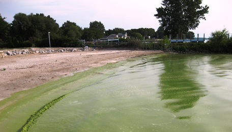

## Summary  

Environmental phenomena are often driven by multiple factors that interact across different spatial and temporal scales. In freshwater lakes and reservoirs worldwide, phytoplankton blooms are increasing in frequency and severity due to cross-scale interactions between local, regional, and continental drivers, including land use (local) and climate change (regional) drivers. Because it is difficult to predict how lakes will respond to interacting processes operating at multiple scales, many researchers are using models to manipulate climate and land use scenarios and see how lakes respond. Lake simulation models provide a powerful tool for exploring how phytoplankton blooms respond to multiple drivers via cross-scale interactions.

In this module, students will learn how to set up a lake model and "force" the model with climate and land use scenarios to test hypotheses about how local and regional drivers interact to promote or suppress phytoplankton blooms in different lakes.

The overarching goal of this module is for students to explore new modeling and computing tools while learning fundamental concepts about how lake phytoplankton blooms occur through cross-scale interactions. The A-B-C structure of this module makes it flexible and adaptable to a range of student levels and course structures.

## Learning Goals  

By the end of this module, students will be able to:
* Understand the concepts of macrosystems ecology and cross-scale interactions, and how different ecological processes can interact at local, regional, and continental scales.
* Simulate phytoplankton blooms in multiple lakes using ecosystem models of lake water quality set up with publicly-available high-frequency sensor datasets (Activity A).
* Test the effects of a climate scenario on the different lake models, and examine how the timing and intensity of phytoplankton blooms change with climate warming (Activity B).
* Examine the effects of both local nutrient loading and regional climate forcing to determine how factors acting at different scales interact to affect the intensity and timing of phytoplankton blooms (Activity C).
* Predict how lake phytoplankton blooms may respond globally to changing climate and land use.

## Context for Use  
This entire module can be completed in one 3-4 hour lab period or three 60-minute lecture periods for senior undergraduate students or graduate students. Activities A and B could be completed with upper level students in two 60-minute lecture periods, with Activity C as a separate add-on activity. We found that teaching this module in one longer lab section with short breaks was more conducive for introductory students than multiple 1-hour lecture periods.

This module is recommended for upper-level undergraduate and graduate-level Ecosystem Ecology, Freshwater Ecology, Global Change Ecology, and Limnology courses (Parts A and B for undergraduate courses; Parts A, B, and C for graduate-level courses). Module materials can be tailored to increase or decrease the background information depending on students' quantitative skills. Depending on the number of students, having additional instructors available to answer questions is useful, particularly if students have limited prior experience using R (e.g., we found that a 10:1 student:teacher ratio or smaller worked well in our classes).

It is helpful for the instructor to have a working knowledge of R and the General Lake Model (GLM) to help troubleshoot and respond to student questions. We provide a brief introduction to R and GLM as part of the Teaching Materials, below.

## Description and Teaching Materials  
### Quick overview of the activities in this module  
See the instructor manual, provided below, for a step-by-step guide for carrying out this module, and an activity answer key. A student handout, describing Activities A, B, and C, and instructor PowerPoint are also provided.
* **Activity A**: Students run a lake model and plot water temperatures and chlorophyll-a concentrations from numerous lakes, using real climate forcing and land use driver data.  
* **Activity B**: Students select a climate scenario, generate hypotheses, and model how different lakes respond.  
* **Activity C**: Students select a land use scenario, generate hypotheses, and model how different lakes respond. Students then model their combined climate and land use change scenarios to examine cross-scale interactions in their lakes.

### Why macrosystems ecology?
Macrosystems ecology is the study of ecological dynamics at multiple interacting spatial and temporal scales (e.g., Heffernan et al. 2014). Macrosystems ecology recently emerged as a new sub-discipline of ecology to study ecosystems and ecological communities around the globe that are changing at an unprecedented rate because of human activities (IPCC 2013). The responses of ecosystems and communities are complex, non-linear, and driven by feedbacks across local, regional, and global scales (Heffernan et al. 2014). These characteristics necessitate novel approaches for making predictions about how systems may continue to change across time and space. Consequently, macrosystems ecologists are increasingly combining large datasets of sensor observations with simulation models of ecological phenomena to predict how changes in climate, land use, and other factors may affect the structure and function of communities and ecosystems (Weathers et al. 2016).  

### A macrosystems approach to lake ecology
Using a macrosystems approach is necessary for studying environmental challenges that are driven by multiple factors across space and over time. In freshwater lakes and reservoirs worldwide, phytoplankton blooms are increasing in frequency and severity due to local, regional, and continental drivers (Brookes and Carey 2011). Some lakes are experiencing more frequent blooms due to changing land use in their watershed; for example, converting forest into agricultural fields or urban areas increases the amount of phosphorus, an element that stimulates phytoplankton growth, entering nearby lakes. Other lakes are experiencing increased blooms due to a warmer climate, because many phytoplankton species can proliferate in warmer waters. Here, changing land use is an example of a local driver, and changing climate is an example of a regional driver. Together, both drivers contribute to an increase in blooms in lakes, though the dominant driver causing the blooms can vary substantially from lake to lake. Due to the non-linear properties of these cross-scale interactions, it can be difficult to predict when phytoplankton blooms will occur by looking at drivers at only one scale.

The theme of this module is studying cross-scale interactions, or examining how local and regional processes occurring over space and time interact to produce macrosystem-level phenomena. In this module, you will work with a partner to study how lakes will respond to changes in climate and land use using an ecosystem simulation model, with the goal of predicting how these local and regional drivers will interact to promote or suppress phytoplankton blooms.

### Workflow for this module:
1. Have students install R and RStudio software on their laptops before class (send them the "R You Ready for EDDIE" file, below, for step-by-step directions).
2. Give students their handout ahead of time to read over prior to class, or distribute handouts when they arrive to class.
3. Instructor gives brief PowerPoint presentation on how macrosystems ecology can be used to understand cross-scale interactions, using the example of how climate and land use change can affect phytoplankton blooms in lakes. The PowerPoint also includes an overview of the GLM-AED model that will be used in the module.
4. After the presentation, the students divide into teams (two pairs of students per team), set up the GLM files and R packages on their computer to run a lake model and explore the output (Activity A).
5. The instructor then introduces Activity B.
6. The students select a climate change scenario, create hypotheses about how changes in air temperature may affect different lakes, force the lakes with their scenario, and analyze the output between the lakes to determine how their scenario alters lake phytoplankton blooms (Activity B).
7. The instructor then introduces Activity C, where students select and run one of the pre-made land use scenarios.
8. The students create hypotheses about how their scenario's change in phosphorus loading may affect their lakes, then force the lakes with their scenario. Students then model their combined climate and land use change scenarios to examine cross-scale interactions in their lakes
9. Teams of students put together figures from their model output to present their model simulations and results to the rest of the class, with the instructor moderating the discussion (Activity C).

### Teaching Materials:
* Files for running Module 2 (Zip Archive 1MB Oct10 19) - Zipped folder of all files needed to run the module in RStudio
* R You Ready for EDDIE? Module 2 (Microsoft Word 2007 (.docx) 23kB Nov19 18) - Step-by-step guide to download R, RStudio, and module files
* Student Handout (Microsoft Word 2007 (.docx) 1.1MB Feb22 19) - Handout for students to work through while completing the module
* Instructor's Manual (Microsoft Word 2007 (.docx) 1.1MB Nov19 18) - Instructor manual and troubleshooting for the module.
* Ready, Set, EDDIE: Module 2 (Microsoft Word 2007 (.docx) 493kB Nov19 18) - Instructor introduction to R and the General Lake Model (GLM)
* Instructor's Powerpoint (PowerPoint 2007 (.pptx) 8.8MB Mar12 19) - PowerPoint presentation to introduce core concepts & module activities
    *  Getting Started: Module 2 (PowerPoint 2007 (.pptx) 4.6MB Jan8 19) - Additional PowerPoint slides that provide a basic orientation to RStudio, and provide troubleshooting tips for common challenges in the module

## Teaching Notes and Tips
### Important Note to Instructors:

The zip folder of teaching materials was last updated using R version 3.5.1 and GLM version 2.2.0rc5. All R packages used in this module are continually being updated, so these module instructions will periodically change to account for changes in the code.

If you have any questions or any problems with this module, please reach out to us at .

### Assessment
* Activity A: Students run a lake model and plot water temperatures and chlorophyll-a concentrations from numerous lakes, using real climate forcing and land use driver data.
* Activity B: Students select a climate scenario, generate hypotheses, and model how different lakes respond.
* Activity C: Students select a land use scenario, generate hypotheses, and model how different lakes respond. Students then model their combined climate and land use change scenarios to examine cross-scale interactions in their lakes.

### References and Resources
#### Optional pre-class readings
* Heffernan, J.B., et al. 2014. "Macrosystems ecology: understanding ecological patterns and processes at continental scales." Frontiers in Ecology and the Environment 12.1: 5-14.
* Raffa K.F., et al. 2008. "Cross-scale drivers of natural disturbances prone to anthropogenic amplification: the dynamics of bark beetle eruptions." BioScience 58: 501–17.
* Note: focus on pages 501-507.
* Paerl, H.W. 2017. "Controlling cyanobacterial harmful blooms in freshwater ecosystems." Microbial Biotechnology. DOI: 10.1111/1751-7915.12725.

#### Tools and data used in this module  

* Hipsey, M. R., L.C. Bruce, and D.P. Hamilton. 2013. Aquatic Ecodynamics (AED) model library and science manual. Draft v4, The University of Western Australia, Perth, Australia. 34 pp.
* Hipsey, M. R., L.C. Bruce, and D.P. Hamilton. 2014. GLM- General Lake Model: Model overview and user information. AED Report #26, The University of Western Australia, Perth, Australia. 42 pp.
* Read, J.S., and L.A. Winslow. 2016. glmtools R package v.0.14.6.
* Winslow, L.A., and J.S. Read. GLMr R package v.3.1.15 and GLMr R package default files. GLMr: A General Lake Model (GLM) base package.

