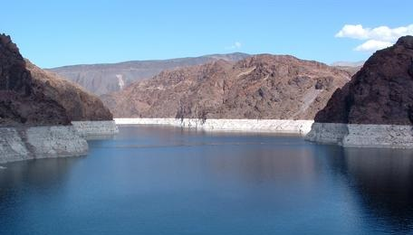

***
## Summary  
Ecosystems can be influenced by _teleconnections_, in which meteorological, societal, and/or ecological phenomenon link remote regions via cause and effect relationships. Because it is difficult to predict how ecosystems will respond to drivers from remote regions, many researchers are using models to simulate different teleconnection scenarios and see how ecosystems respond. For example, lake simulation models provide a powerful tool for exploring how lake thermal structure and ice cover respond to climate teleconnections such as the El Niño/Southern Oscillation (ENSO).

In this module, students will learn how to set up a lake model and "force" the model with climate scenarios to test hypotheses about how far-away drivers interact with local lake characteristics to affect lake temperatures and ice cover in different lakes. 

The overarching goal of this module is for students to explore new modeling and computing tools while learning fundamental concepts about how teleconnections affect lake temperatures and ice cover. The A-B-C structure of this module makes it flexible and adaptable to a range of student levels and course structures.

***

## Learning Goals  

* By the end of this module, students will be able to:
* Understand the concepts of macrosystems ecology and teleconnections, and how different ecological processes can interact at local, regional, and global scales.
* Set up and run ecosystem models to simulate lake temperatures and ice cover in multiple lakes (Activity A).
* Test the effects of teleconnected climate scenarios on the different lake models, and examine how local characteristics modify global-scale climate forcing effects on lake temperatures and ice cover (Activity B).
* Compare the role of teleconnections in driving lake temperatures and ice cover across multiple lakes in different regions (Activity C). Predict how lake temperatures and ice cover may respond to changes in the timing and intensity of global-scale meteorological phenomena (Activity C).

## Context for Use  
This entire module can be completed in one 3-4 hour lab period or three 60-minute lecture periods for senior undergraduate students or graduate students. We found that teaching this module in one longer lab section with short breaks was more conducive for introductory students than multiple 1-hour lecture periods.

This module is recommended for upper-level undergraduate and graduate-level Ecosystem Ecology, Freshwater Ecology, Global Change Ecology, Climate Science, and Environmental Science courses. Module materials can be tailored to increase or decrease the background information depending on students' quantitative skills. Depending on the number of students, having additional instructors available to answer questions is useful, particularly if students have limited prior experience using R (e.g., we found that a 10:1 student:teacher ratio or smaller worked well in our classes).

It is helpful for the instructor to have a working knowledge of R and the General Lake Model (GLM) to help troubleshoot and respond to student questions. We provide a brief introduction to R and GLM as part of the Teaching Materials, below.

## Description and Teaching Materials  
### Quick overview of the activities in this module  
See the instructor manual, provided below, for a step-by-step guide for carrying out this module, and an activity answer key. A student handout, describing Activities A, B, and C, and instructor PowerPoint are also provided.

* **Activity A**: Students run a lake model, and plot lake temperatures and ice cover from numerous lakes in different regions, using real climate driver data. 
* **Activity B**: Students modify climate driver data to simulate two different El Niño scenarios for their model lake, generate hypotheses, and then use the GLM model to see how different lakes respond.  
* **Activity C**: Students discuss the relative strength of El Niño teleconnections in altering water temperatures among lakes in different regions, and make predictions about how lakes may respond to changes in the timing and intensity of global-scale meteorological phenomena.  

### Why macrosystems ecology?
Macrosystems ecology is the study of ecological dynamics at multiple interacting spatial and temporal scales (e.g., Heffernan et al. 2014). Macrosystems ecology recently emerged as a new sub-discipline of ecology to study ecosystems and ecological communities around the globe that are changing at an unprecedented rate because of human activities (IPCC 2013). The responses of ecosystems and communities are complex, non-linear, and driven by feedbacks across local, regional, and global scales (Heffernan et al. 2014). These characteristics necessitate novel approaches for making predictions about how systems may change across time and space. Consequently, macrosystems ecologists are increasingly combining large datasets of sensor observations with simulation models of ecological phenomena to predict how changes in climate, land use, and other factors may affect the structure and function of communities and ecosystems (Weathers et al. 2016).

### A macrosystems approach to lake ecology
Using a macrosystems approach is necessary for studying environmental challenges that are driven by multiple factors across space and over time. In freshwater lakes and reservoirs worldwide, water temperatures are changing in response to local, regional, and global drivers (O'Reilly et al. 2015). For example, some lakes are experiencing changes in water temperature due to local-scale changes in land use (e.g., increasing impervious surface in a catchment can result in warmer inflow streams entering a lake) and regional-scale changes due to altered weather patterns (e.g., climate change is increasing air temperatures in some regions, resulting in warmer water temperatures). Lake temperatures and ice cover can also be affected by global drivers, such as the El Niño/Southern Oscillation (ENSO). ENSO is an example of a climate teleconnection, or a phenomenon that links remote regions via cause and effect relationships. ENSO periods have warmer ocean surface temperatures in the tropical Pacific Ocean, resulting in altered atmospheric circulation, air temperature, and precipitation patterns worldwide, but the global effect of ENSO on a particular lake is mediated by local and regional dynamics.

The theme of this module is studying the effect of global ENSO _teleconnections_ on lake temperatures and ice cover. In this module, you will work with a partner to study how global circulation patterns interact with local and regional characteristics to affect lake temperatures and ice cover in different lakes and reservoirs across the United States.

### Workflow for this module:
1. Have students install R and RStudio software on their laptops before class (send them the "R You Ready for EDDIE" file, below, for step-by-step directions).
2. Give students their handout ahead of time to read over prior to class, or distribute handouts when they arrive to class.
3. Instructor gives brief PowerPoint presentation on how macrosystems ecology can be used to understand teleconnections, using the example of how far-away meteorological phenomena can affect lake temperatures and ice cover. The PowerPoint also includes an overview of the GLM model that will be used in the module.
4. After the presentation, the students divide into pairs, with each pair selecting a different lake to model from the list of available lakes, then set up the GLM files and R packages on their computer to run their lake model and explore the output (Activity A).
5. The instructor then introduces Activity B.
6. Students analyze local long-term climate data to explore how El Niño affects air temperatures around their focal lake and create hypotheses about how air temperature changes due to El Niño could affect lake water temperatures and ice cover in the future. They then modify model driver data to force the lake with realistic "typical" and "strong" El Niño meteorological scenarios, and analyze the output to determine how El Niño teleconnections alter lake temperatures and ice cover (Activity B).
7. After analyzing their model output, pairs of students create some figures to present their El Niño scenarios and resulting model outputs to the rest of the class, contrasting El Niño scenarios and lake responses among lakes from different regions.
8. The instructor then moderates a discussion of the effects of the El Niño scenarios on different lakes, and how individual lake responses could change in the future if the timing or intensity of global-scale meteorological phenomena like El Niño changes (Activity C).

### Teaching Materials:
_Note: We continue to update our lake model calibrations, so check back frequently to make sure you have the most up-to-date zip folder of files to use!_
* Files for Running Module 3 (Zip Archive 2.5MB Oct11 19)- Zipped folder of all files needed to run the module in RStudio
* R You Ready for EDDIE? Module 3 (Microsoft Word 2007 (.docx) 23kB Nov19 18)- Step-by-step guide to download R, RStudio, and module files
* Student Handout (Microsoft Word 2007 (.docx) 797kB Oct29 19)- Handout for students to work through while completing the module
* Instructor's Manual (Microsoft Word 2007 (.docx) 1.2MB Nov19 18)- Instructor guidelines and troubleshooting for the module. Includes answer key and discussion questions.
* Ready, Set, EDDIE: Module 3 (Microsoft Word 2007 (.docx) 344kB Nov19 18)- Instructor introduction to R and the General Lake Model (GLM)
* Instructor PowerPoint (PowerPoint 2007 (.pptx) 8.6MB Nov19 18)- PowerPoint presentation to introduce core concepts & module activities
    *  Getting Started with Macrosystems EDDIE (PowerPoint 2007 (.pptx) 2.5MB Jan8 19)- Additional PowerPoint slides that walk through module setup step-by-step and provide troubleshooting tips for common challenges

## Teaching Notes and Tips
### Important Note to Instructors:

The zip folder of teaching materials was last updated using R version 3.5.1 and GLM version 2.2.0rc5. All R packages used in this module are continually being updated, so these module instructions will periodically change to account for changes in the code.

If you have any questions or any problems with this module, please reach out to us at .

### Assessment
* Activity A: Students run a lake model, and plot lake temperatures and ice cover from numerous lakes in different regions, using real climate driver data.
* Activity B: Students modify climate driver data to simulate two different El Niño scenarios for their model lake, generate hypotheses, and then use the GLM model to see how different lakes respond.
* Activity C: Students discuss the relative strength of El Niño teleconnections in altering water temperatures among lakes in different regions, and make predictions about how lakes may respond to changes in the timing and intensity of global-scale meteorological phenomena.

### References and Resources
#### Optional pre-class readings
* Heffernan, J.B., et al. 2014. "Macrosystems ecology: understanding ecological patterns and processes at continental scales." Frontiers in Ecology and the Environment 12.1: 5-14.
* National Oceanic and Atmospheric Administration "El Niño-Southern Oscillation" website: https://www.climate.gov/enso

#### Tools and data used in this module  

* Hipsey, M. R., L.C. Bruce, and D.P. Hamilton. 2014. GLM- General Lake Model: Model overview and user information. AED Report #26, The University of Western Australia, Perth, Australia. 42 pp.
* Read, J.S., and L.A. Winslow. 2016. glmtools R package v.0.14.6.
* Winslow, L.A., and J.S. Read. GLMr R package v.3.1.15 and GLMr R package default files. GLMr: A General Lake Model (GLM) base package.
