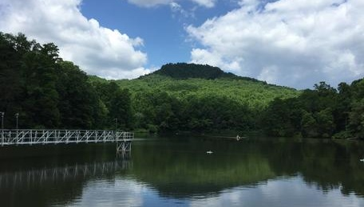

***
## Summary  
Environmental phenomena are often driven by multiple factors that interact across space and over time. In freshwater lakes and reservoirs worldwide, carbon cycling and subsequent carbon dioxide (CO2) and methane (CH4) fluxes are changing due to local, regional, and continental drivers.

In this module, students will learn how to set up a lake model and "force" the model with climate scenarios to test hypotheses about how local and global drivers will interact to promote or suppress greenhouse gas fluxes in different lakes.

The overarching goal of this module is for students to explore new modeling and computing tools while learning fundamental concepts about how non-linear macrosystem-level phenomena (e.g., lake greenhouse gas fluxes) can occur through macro-scale feedbacks.

***

## Learning Goals  

By the end of this module, students will be able to:
* Understand the concepts of macrosystems ecology and macro-scale feedbacks, and how different ecological processes can interact at local, regional, and continental scales.
* Simulate greenhouse gas fluxes in multiple lakes using ecosystem models of lake water chemistry set up with publicly-available high-frequency sensor datasets (Activity A).
* Test the effects of a climate scenario on the different lake models and examine how the timing and magnitude of greenhouse gas fluxes change with climate warming (Activity B).
* Examine how local conditions may alter the timing and magnitude of greenhouse gas fluxes from lakes to affect global climate change (Activity C).
* Predict how lake greenhouse gas fluxes may both respond to and amplify changing climate.

## Context for Use  
This entire module can be completed in one 3-4 hour lab period or three 60-minute lecture periods for senior undergraduate students or graduate students. Activities A and B could be completed with upper level students in two 60-minute lecture periods, with Activity C as a separate add-on activity.

This module is recommended for upper-level undergraduate and graduate-level Ecosystem Ecology, Freshwater Ecology, Global Change Ecology, and Limnology courses (Parts A and B for undergraduate courses; Parts A, B, and C for graduate-level courses). Some of the modeling in this module examines lake ecosystem ecology concepts not generally covered in introductory ecology courses. Thus, we highly recommend that instructors review module materials before teaching the module and tailor module materials (i.e., Instructor PowerPoint, Student Handout) to the individual needs of their classrooms. In these materials, we purposely included additional background information that may not be necessary for more advanced classrooms. Depending on the number of students, having additional instructors available to answer questions is useful, particularly if students have limited prior experience using R (e.g., we found that a 10:1 student:teacher ratio or smaller worked well in our classes).

It is helpful for the instructor to have a working knowledge of R and the General Lake Model (GLM) to help troubleshoot and respond to student questions. We provide a brief introduction to R and GLM as part of the Teaching Materials, below.

## Description and Teaching Materials  
### Quick overview of the activities in this module  
See the instructor manual, provided below, for a step-by-step guide for carrying out this module, and an activity answer key. A student handout, describing Activities A, B, and C, and instructor PowerPoint are also provided.  

* **Activity A**: Students explore and run a lake biogeochemistry model in R. 
* **Activity B**: Students generate hypotheses about how lake CO2 and CH4 fluxes will respond to climate warming, and model how different lakes respond.
* **Activity C**: Students calculate global warming potentials for their lakes for both baseline and climate scenarios, compare greenhouse gas fluxes among lakes, and make predictions about the effects of lake greenhouse gas emissions due to macro-scale feedbacks at the continental scale.

### Why macrosystems ecology?
Macrosystems ecology is the study of ecological dynamics at multiple interacting spatial and temporal scales (e.g., Heffernan et al. 2014). Macrosystems ecology recently emerged as a new sub-discipline of ecology to study ecosystems and ecological communities around the globe that are changing at an unprecedented rate because of human activities (IPCC 2013). The responses of ecosystems and communities are complex, non-linear, and driven by feedbacks across local, regional, and global scales (Heffernan et al. 2014). These characteristics necessitate novel approaches for making predictions about how systems may continue to change across time and space. Consequently, macrosystems ecologists are increasingly combining large datasets of sensor observations with simulation models of ecological phenomena to predict how changes in climate, land use, and other factors may affect the structure and function of communities and ecosystems (Weathers et al. 2016).  

### A macrosystems approach to lake ecology
Using a macrosystems approach is necessary for studying environmental challenges that are driven by multiple factors across space and over time. In freshwater lakes and reservoirs worldwide, carbon cycling and subsequent carbon dioxide (CO2) and methane (CH4) fluxes are changing due to local, regional, and continental drivers (Butman et al. 2018). These fluxes can be either positive (the lake is emitting CO2 and CH4 that is released into the atmosphere) or negative (CO2 and CH4 is being taken up by the lake and removed from the atmosphere). As lakes warm due to climate change, they may exhibit more negative CO2 fluxes as warmer water temperatures stimulate phytoplankton growth, resulting in higher rates of photosynthesis and greater CO2 uptake. Conversely, lakes may exhibit greater positive CH4fluxes because warming can decrease oxygen concentrations in lake bottom waters, increasing CH4 production at the lake sediments and subsequent release into the atmosphere. We quantify the net effect of lake CO2 and CH4 fluxes on atmospheric warming using Global Warming Potentials (GWPs), a metric of how much energy greenhouse gases absorb in CO2 mass units (Myhre et al. 2013). Because one gram of CH4 absorbs 86 times as much energy as one gram of CO2, CH4 is assigned a GWP of 86 over a 20-year time horizon (CO2 is assigned a GWP of 1). We sum all of the CO2 and CH4 fluxes from a lake over a year to calculate its GWP and compare it with other lakes.

In many lakes, warming due to climate change could create a _macro-scale feedback_, where processes occurring on different scales interact to amplify (positive feedback) or diminish (negative feedback) each other (following Heffernan et al. 2014). For example, a positive macro-scale feedback could occur when local air temperatures warm, amplifying lake CH4 fluxes to the atmosphere, which in turn amplifies global climate change and further increases air temperatures. Both local and global drivers interact to change carbon cycling and CO2 and CH4 fluxes in lakes, though the direction and magnitude of fluxes vary substantially among lakes due to differences in their baseline phytoplankton communities, oxygen concentrations, and other factors.

In this module, you will work with a partner to study how carbon cycling in lakes will respond to warming due to climate change using an ecosystem simulation model, with the goal of predicting how local and global drivers will interact to promote or suppress greenhouse gas fluxes in different lakes. We will examine how local and global processes interact to create macro-scale feedbacks to produce macrosystem-level phenomena (here, focusing on greenhouse gas fluxes in lakes across the U.S.).

### Workflow for this module:
1. Have students install R and RStudio software on their laptops before class (send them the Module 4 "R You Ready for EDDIE" file for step-by-step directions).
2. Give students their handout ahead of time to read over prior to class, or distribute handouts when they arrive to class. We recommend having students read pages 1-3 before class as homework, and that instructors print out the remaining pages to have students complete during the module and return to the instructor at the end.
3. Instructor gives brief PowerPoint presentation on how macrosystems ecology can be used to understand macro-scale feedbacks, using the example of how climate change can affect greenhouse gas fluxes in lakes. The PowerPoint also includes an overview of the GLM-AED model that students will use in the module.
4. After the presentation, the students divide into teams (aiming for two students per team), choose a lake to model, set up the GLM files and R packages on their computer to run their lake model, and explore the output (Activity A).
5. The instructor then introduces Activity B, where students select and run one of the pre-made climate scenarios.
6. The students create hypotheses about how their air temperature scenario may affect their lakes, force the lakes with their climate scenario, and analyze the output between the lakes to determine how their scenario alters lake greenhouse gas fluxes (Activity B).
7. The instructor then introduces Activity C, where students calculate global warming potentials for their lake under the baseline and climate change scenarios. Students then visualize the output from their baseline and climate change scenarios to examine macro-scale feedbacks in their lakes.
8. Teams of students put together figures from their model output to present their model simulations to the rest of the class, with the goal of comparing macro-scale feedbacks among lakes as the instructor moderates the discussion (Activity C).

### Teaching Materials:
* Files for running Module 4 (Zip Archive 2.1MB Nov11 19) - Zipped folder of all files needed to run the module in RStudio
* R You Ready for EDDIE? Module 4 (Microsoft Word 2007 (.docx) 25kB Apr15 20) - Step-by-step guide to download R, RStudio, and module files
* Student Handout (Microsoft Word 2007 (.docx) 1.2MB Apr15 20) - Handout for students to work through while completing the module
* Instructor Manual (Microsoft Word 2007 (.docx) 2.7MB Apr15 20) - Instructor manual and troubleshooting for the module.
* Ready, Set, EDDIE: Module 4 (Microsoft Word 2007 (.docx) 1.6MB Apr15 20) - Instructor introduction to R and the General Lake Model (GLM)
* Instructor's Powerpoint (PowerPoint 2007 (.pptx) 11MB Apr15 20) - PowerPoint presentation to introduce core concepts & module activities
    *  Getting Started Module 4 (PowerPoint 2007 (.pptx) 6MB Apr15 20) - Additional PowerPoint slides that provide a basic orientation to RStudio, and provide troubleshooting tips for common challenges in the module

## Teaching Notes and Tips
### Important Note to Instructors:

The zip folder of teaching materials was last updated using R version 3.6.3 and GLM version 2.2.0rc5. All R packages used in this module are continually being updated, so these module instructions will periodically change to account for changes in the code.

If you have any questions or any problems with this module, please reach out to us at .

### Assessment
* Activity A: Students run a lake model and plot water temperatures and greenhouse gas (carbon dioxide, methane) fluxes from numerous lakes, using real climate forcing driver data.
* Activity B: Students select a climate scenario, generate hypotheses, and model how different lakes respond.
* Activity C: Students use their scenarios to calculate global warming potential and examine macro-scale feedbacks among lakes.

### References and Resources
#### Optional pre-class readings
* EPA 2019. Understanding global warming potentials. https://www.epa.gov/ghgemissions/understanding-global-warming-potentials
* Heffernan, J.B., et al. 2014. Macrosystems ecology: understanding ecological patterns and processes at continental scales. Frontiers in Ecology and the Environment 12: 5-14.
* Tranvik, L.J., et al. 2009. Lakes and reservoirs as regulators of carbon cycling and climate. Limnology and Oceanography. 54: 2298-2314. (Especially focus on pages 2298-2302)

#### Tools and data used in this module  

* Hipsey, M. R., et al. 2013. Aquatic Ecodynamics (AED) model library and science manual. Draft v4, The University of Western Australia, Perth, Australia. 34 pp.
* Hipsey, M. R., et al. 2019. A General Lake Model (GLM 3.0) for linking with high-frequency sensor data from the Global Lake Ecological Observatory Network (GLEON). Geoscientific Model Development 12:473–523.
* Read, J.S., and L.A. Winslow. 2016. glmtools R package v.0.14.6.
* Winslow, L.A., and J.S. Read. GLMr R package v.3.1.15 and GLMr R package default files. GLMr: A General Lake Model (GLM) base package.
