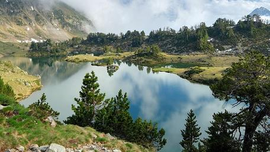
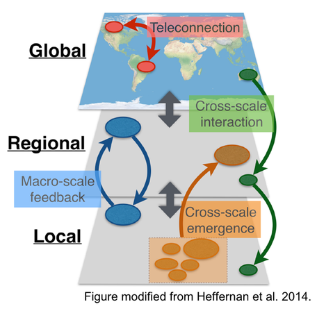

Macrosystems EDDIE modules will help students across the U.S. to learn the foundations of macrosystems ecology through modeling and forecasting. Through our modules, both students and their instructors will learn how to quickly and efficiently run ecological models and generate forecasts for multiple NEON and GLEON sites. Thus, students will simultaneously learn the core concepts of macrosystems science and develop the quantitative skill sets needed to conduct the next generation of environmental research. Macrosystems EDDIE modules, which are centered on the frontier of macrosystems ecology, will enable undergraduate students to contribute to high-level ecological research. Engaging undergraduate students in hands-on modeling and forecasting activities with real-world applications translates into a workforce with increased data science, systems thinking, and quantitative skills.

## Project Description  
Ecologists are increasingly using models, based on large datasets of observations obtained through environmental sensor networks, to study ecosystems and forecast future change. Developing forecasts requires skills in data analysis, ecological modeling, quantitative reasoning, and computing. However, modeling and computational skills are rarely taught in undergraduate classrooms, representing a major gap in training students to tackle complex environmental challenges.  

### Macrosystems Ecology  

**Macrosystems ecology** is the study of ecological dynamics at multiple interacting spatial and temporal scales (e.g., Heffernan et al. 2014). For example, global climate change can interact with local land-use activities to control how an ecosystem changes over the next decades. Macrosystems ecology recently emerged as a new sub-discipline of ecology to study ecosystems and ecological communities around the globe that are changing at an unprecedented rate because of human activities (IPCC 2013). The responses of ecosystems and communities are complex, non-linear, and driven by feedbacks across local, regional, and global scales (Heffernan et al. 2014). These characteristics necessitate novel approaches for making predictions about how systems may change to improve both our understanding of ecological phenomena as well as inform resource management.  

**Forecasting** is a tool that can be used for understanding and predicting macrosystems dynamics. To anticipate and prepare for increased variability in populations, communities, and ecosystems, there is a pressing need to know the future state of ecological systems across space and time (Dietze et al. 2018). Ecological forecasting is an emerging approach which provides an estimate of the future state of an ecological system with uncertainty, allowing society to prepare for changes in important ecosystem services. Ecological forecasts are a powerful test of the scientific method because ecologists make a hypothesis of how an ecological system works; embed their hypothesis in a model; use the model to make a forecast of future conditions; and then when observations become available, assess the accuracy of their forecast, which indicates if their hypothesis is supported or needs to be updated. Forecasts that are effectively communicated to the public and managers will be most useful for aiding decision-making. Consequently, macrosystems ecologists are increasingly using ecological forecasts to predict how ecosystems are changing over space and time.  

Our interdisciplinary team is developing flexible classroom modules that introduce undergraduate students to the core concepts of macrosystems ecology and ecological forecasting. Each module utilizes long-term, high-frequency, and sensor-based datasets from diverse sources, including the Global Lakes Ecological Observatory Network, the United States Geological Survey, the Long Term Ecological Research Network, and the National Ecological Observatory Network.  

Each module can be adapted for use in introductory, intermediate, and advanced courses in ecology and related fields, in order to enhance students' understanding of macrosystems ecology and ecological forecasting, their computational skills, and their ability to conduct inquiry-based studies.  

## Project Goals  
Our objective is to develop stand-alone, modular classroom activities for undergraduate students that use publicly-available, long-term, and high-frequency datasets to explore the core concepts of macrosystems ecology and ecological forecasting while developing quantitative literacy.  
The Macrosystems EDDIE modules are specifically designed to help students achieve the following pedagogical goals:  
1. Improve students' ability to understand and predict how local, regional, and continental processes interact to mediate responses to human activities
2. Gain computational skills through engagement in ecological forecasting, simulation modeling, computer programming, distributed computing, and the analysis of large datasets
3. Develop hypotheses, conduct inquiry-based studies to test them, and evaluate if their hypotheses are supported or rejected by data  

## Where Do Our Data Sets Come From?
Macrosystems EDDIE modules utilize long-term, high-frequency, and sensor-based datasets from diverse, publicly-accessible sources. Click the links below to learn more about our data providers.
* Global Lakes Ecological Observatory Network: ([GLEON](http://gleon.org/))
* National Ecological Observatory Network: ([NEON](http://www.neonscience.org/))
* Long Term Ecological Research Network: ([LTER](https://lternet.edu/))
* United States Geological Survey (USGS): [Water Data for the Nation](https://waterdata.usgs.gov/nwis)
* United States Environmental Protection Agency (EPA): [National Lakes Assessment](https://www.epa.gov/national-aquatic-resource-surveys/nla) and [SPARROW](https://cfpub.epa.gov/si/si_public_record_report.cfm?Lab=ORA&count=10000&dirEntryId=73361&searchall=&showcriteria=2&simplesearch=0&timstype=)
* National Oceanic and Atmospheric Administration (NOAA): [National Centers for Environmental Information](https://www.ncdc.noaa.gov/)  

## Assessment
During 2017-2022, we will be using pre- and post-module student questionnaires and soliciting instructor feedback to assess whether our Macrosystems EDDIE modules are achieving their pedagogical goals. These assessments will allow us to determine whether the modules are helping increase students' understanding of macrosystems ecology and ecological forecasting skills, and will allow us to revise modules as needed to maximize their utility to instructors and students. Previous assessments of EDDIE modules found that students who completed EDDIE modules had significantly improved data manipulation skills, an increased understanding of how to use large datasets, and a greater appreciation for the value of high-resolution and long-term data. Thus, in addition to developing critical quantitative and modeling skills, working with high-frequency sensor datasets cements the real-world application of basic ecological concepts.  

## Project Support
Macrosystems EDDIE is supported by funding from NSF EF-1702506, DEB-1926050, DEB-1926050 and DBI-1933016  

## We welcome your feedback!
If you have any comments, questions, or suggestions to provide to the Macrosystems EDDIE team, please fill out our brief Feedback Form! We also invite your feedback at [MacrosystemsEDDIE@gmail.com]()  

## References and Resources
* Dietze, M. C., Fox, A., Beck-Johnson, L. M., Betancourt, J. L., Hooten, M. B., Jarnevich, C. S., Keitt, T. H., Kenney, M. A., Laney, C. M., Larsen, L. G., Loescher, H. W., Lunch, C. K., Pijanowski, B. C., Randerson, J. T., Read, E. K., Tredennick, A. T., Vargas, R., Weathers, K. C., & White, E. P. (2018). Iterative near-term ecological forecasting: Needs, opportunities, and challenges. Proceedings of the National Academy of Sciences, 115(7), 1424–1432. https://doi.org/10.1073/pnas.1710231115
* Heffernan, J.B., et al. 2014. "Macrosystems ecology: understanding ecological patterns and processes at continental scales." Frontiers in Ecology and the Environment 12.1: 5-14. Available: http://onlinelibrary.wiley.com/doi/10.1890/130017/abstract
* IPCC. 2013. Climate Change 2013: The Physical Science Basis. Contribution of Working Group I to the Fifth Assessment Report of the Intergovernmental Panel on Climate Change. Page (T. F. Stocker, D. Qin, G.-K. Plattner, M. Tignor, S. K. Allen, J. Boschung, A. Nauels, Y. Xia, V. Bex, and P. M. Midgley, Eds.). Cambridge University Press, New York, NY. Available: http://www.ipcc.ch/report/ar5/wg1/
* Weathers, K. C., P. M. Groffman, E. Van Dolah, E. Bernhardt, N. B. Grimm, K. McMahon, J. Schimel, M. Paolisso, R. Maranger, S. Baer, K. Brauman, and E. Hinckley. 2016. Frontiers in Ecosystem Ecology from a Community Perspective: The Future is Boundless and Bright. Ecosystems 19:753–770. Available: https://link.springer.com/article/10.1007%2Fs10021-016-9967-0
